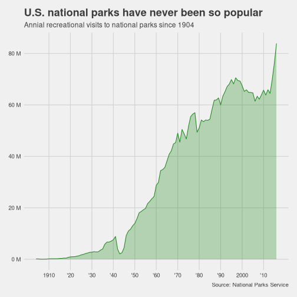
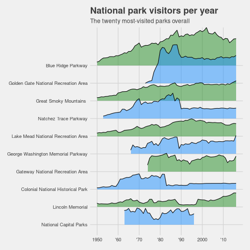

<style>
.reveal h1, .reveal h2, .reveal h3 {
  word-wrap: normal;
  -moz-hyphens: none;
}
.small-code pre code {
  font-size: 1em;
}
.midcenter {
    position: fixed;
    top: 50%;
    left: 50%;
}
.footer {
    color: black; background: #E8E8E8;
    position: fixed; top: 90%;
    text-align:center; width:100%;
}
.pinky .reveal .state-background {
  background: #FF69B4;
}
.pinky .reveal h1,
.pinky .reveal h2,
.pinky .reveal p {
  color: black;
}

pre {
  white-space: pre !important;
  overflow-y: scroll !important;
  height: 50vh !important;
}

</style>


#TidyTuesday 38: податоци од националните паркови во САД
========================================================
author: novica
date: 17.09.2019
autosize: true

Резиме
========================================================

- .Rmd (R Markdown) е околината во која ќе работиме;
- Нов R Notebook: Мени: File -> New File -> R notebook
- Корисни кратенки:
  - code chunks (ctrl+alt+i)
  - pipes %>% (ctrl+shift+m)
  - assignment ( <- )
  - view()

Pipes expained, maybe
========================================================

<blockquote class="twitter-tweet" data-lang="en"><p lang="en" dir="ltr">This is how I explain the &#39;pipe&#39; to <a href="https://twitter.com/hashtag/rstats?src=hash&amp;ref_src=twsrc%5Etfw">#rstats</a> newbies... <a href="https://t.co/VdAFTLzijy">pic.twitter.com/VdAFTLzijy</a></p>&mdash; We are R-Ladies (@WeAreRLadies) <a href="https://twitter.com/WeAreRLadies/status/1172576445794803713?ref_src=twsrc%5Etfw">September 13, 2019</a></blockquote>
<script async src="https://platform.twitter.com/widgets.js" charset="utf-8"></script>

Нов dataset
========================================================

<blockquote class="twitter-tweet"><p lang="en" dir="ltr">The <a href="https://twitter.com/R4DScommunity?ref_src=twsrc%5Etfw">@R4DScommunity</a> welcomes you to week 38 of <a href="https://twitter.com/hashtag/TidyTuesday?src=hash&amp;ref_src=twsrc%5Etfw">#TidyTuesday</a>! We&#39;re exploring National Park Visits!!<br><br>📁 <a href="https://t.co/sElb4fcv3u">https://t.co/sElb4fcv3u</a><br>🗞 <a href="https://t.co/uKMrTmKokT">https://t.co/uKMrTmKokT</a><a href="https://twitter.com/hashtag/r4ds?src=hash&amp;ref_src=twsrc%5Etfw">#r4ds</a> <a href="https://twitter.com/hashtag/tidyverse?src=hash&amp;ref_src=twsrc%5Etfw">#tidyverse</a> <a href="https://twitter.com/hashtag/rstats?src=hash&amp;ref_src=twsrc%5Etfw">#rstats</a> <a href="https://twitter.com/hashtag/dataviz?src=hash&amp;ref_src=twsrc%5Etfw">#dataviz</a> <a href="https://t.co/92S7a7mzuj">pic.twitter.com/92S7a7mzuj</a></p>&mdash; Thomas Mock 👨🏼
💻 (@thomas_mock) <a href="https://twitter.com/thomas_mock/status/1173586589462740994?ref_src=twsrc%5Etfw">September 16, 2019</a></blockquote> <script async src="https://platform.twitter.com/widgets.js" charset="utf-8"></script>


Бавен ggplot
========================================================
class: small-code

Вообичаено:


```r
ggplot(my_data,
 aes(var1, y = var2, col = var3)) +
  geom_point() +
  ggtitle("My Title") +
  labs(x = "the x label",
   y = "the y label",
   col = "legend title")
```

(извор:[EvaMaeRey](https://github.com/EvaMaeRey/little_flipbooks_library/tree/master/minimal_example))

***

Бавно:


```r
ggplot(data = my_data) +
  aes(x = var1) +
  labs(x = "the x label") +
  aes(y = var2) +
  labs(y = "the y label") +
  geom_point() +
  aes(col = var3) +
  labs(col = "legend title") +
  labs(title = "My title")
```

Ѕирни ги податоците со glimpse
========================================================
class: small-code


```
Observations: 21,560
Variables: 12
$ year              <chr> "1904", "1941", "1961", "1935", "1982", "1919"…
$ gnis_id           <chr> "1163670", "1531834", "2055170", "1530459", "2…
$ geometry          <chr> "POLYGON", "MULTIPOLYGON", "MULTIPOLYGON", "MU…
$ metadata          <chr> NA, NA, NA, NA, NA, NA, NA, NA, NA, NA, NA, NA…
$ number_of_records <dbl> 1, 1, 1, 1, 1, 1, 1, 1, 1, 1, 1, 1, 1, 1, 1, 1…
$ parkname          <chr> "Crater Lake", "Lake Roosevelt", "Lewis and Cl…
$ region            <chr> "PW", "PW", "PW", "PW", "PW", "NE", "IM", "NE"…
$ state             <chr> "OR", "WA", "WA", "WA", "CA", "ME", "TX", "MD"…
$ unit_code         <chr> "CRLA", "LARO", "LEWI", "OLYM", "SAMO", "ACAD"…
$ unit_name         <chr> "Crater Lake National Park", "Lake Roosevelt N…
$ unit_type         <chr> "National Park", "National Recreation Area", "…
$ visitors          <dbl> 1500, 0, 69000, 2200, 468144, 64000, 448000, 7…
```

Години и посетители #1
========================================================
class: small-code


```r
pv_grouped <- park_visits %>%
  filter(unit_type == "National Park") %>%
  filter(!year == "Total") %>%
  group_by(year) %>%
  summarise_at(.vars = vars("visitors"),
    .funs = list("visitors_per_year"=sum)) %>%
  mutate(year = as.numeric(year))
pv_grouped
```

Години и посетители #2
========================================================
class: small-code

```
# A tibble: 113 x 2
    year visitors_per_year
   <dbl>             <dbl>
 1  1904            120690
 2  1905            140954
 3  1906             30569
 4  1907             32935
 5  1908             42768
 6  1909             60899
 7  1910            173416
 8  1911            193757
 9  1912            197884
10  1913            216403
# … with 103 more rows
```

График за години и посетители #1
========================================================
class: small-code

```r
 ggplot(data = pv_grouped) +
    aes(x = year) +
    aes(y = visitors_per_year / 10^6) +
    geom_line(color = "forestgreen") +
    geom_area(alpha = .3, fill = "forestgreen") +
    scale_y_continuous(labels = scales::unit_format(unit = "M")) +
    scale_x_continuous(breaks = seq(1910, 2016, 10),
      labels = c(1910, paste("'", seq(20, 90, 10), sep = ""), 2000, "'10")) +
    labs(x="") +
    labs(y="") +
    labs(title="U.S. national parks have never been so popular") +
    labs(subtitle="Annial recreational visits to national parks since 1904") +
    labs(caption="Source: National Parks Service") +
    ggthemes::theme_fivethirtyeight()
```

График за години и посетители #2
========================================================



Најдобрите 10 паркови #1
========================================================
class: small-code

```r
top10 <- park_visits %>%
  filter(year == "Total") %>%
  arrange(desc(visitors)) %>%
  top_n(n = 10, wt=visitors)

pv2 <- park_visits %>%
  filter(!year == "Total") %>%
  select(year, unit_name, visitors) %>%
  group_by(year) %>%
  mutate(year_rank = rank(-visitors)) %>%
  ungroup %>%
  mutate(year = as.numeric(year)) %>%
  arrange(year, year_rank)

pv2_top10 <- filter(.data = pv2, unit_name %in% top10$unit_name)

pv2_top10
```

Најдобрите 10 паркови #2
========================================================
class: small-code

```
# A tibble: 651 x 4
    year unit_name                           visitors year_rank
   <dbl> <chr>                                  <dbl>     <dbl>
 1  1931 Great Smoky Mountains National Park   154000       8  
 2  1932 Colonial National Historical Park     400000       2  
 3  1932 Great Smoky Mountains National Park   300000       3  
 4  1933 Great Smoky Mountains National Park   375000       1  
 5  1933 Colonial National Historical Park      66418      14  
 6  1934 Great Smoky Mountains National Park   420000       2  
 7  1934 Colonial National Historical Park      58303      25  
 8  1935 Great Smoky Mountains National Park   500000       2  
 9  1935 Colonial National Historical Park     367172       5  
10  1936 Lincoln Memorial                      857441       1.5
# … with 641 more rows
```
График за најдобрите 10 паркови #1
========================================================
class: small-code


```r
library(ggridges)
ord <- top10$unit_name[order(top10$visitors, decreasing = FALSE)]
lbl <- str_remove(ord, "National Park")

ggplot(data = pv2_top10) +
  aes(x = year) +
  aes(y = unit_name) +
  aes(fill = unit_name) +
  aes(group = unit_name) +
  aes(height = visitors) +
  aes(scale = .0000001) +
  ggridges::geom_ridgeline(alpha = .5) +
  theme_ridges() +
  labs(y = "") +
  labs(x = "") +
  labs(title = "National park visitors per year") +
  labs(subtitle = "The twenty most-visited parks overall") +
  # theme(axis.text.y = element_text(size = 14)) +
  scale_y_discrete(limits = ord, labels = lbl) +
  scale_fill_cyclical(limits = ord, values = c("dodgerblue", "forestgreen")) +
  scale_x_continuous(
    limits = c(1950, 2016),
    breaks = seq(1950, 2016, 10),
    labels = c("1950", "'60", "'70", "'80", "'90", "2000", "'10")
  ) +
  ggthemes::theme_fivethirtyeight()
```

График за најдобрите 10 паркови #2
========================================================


