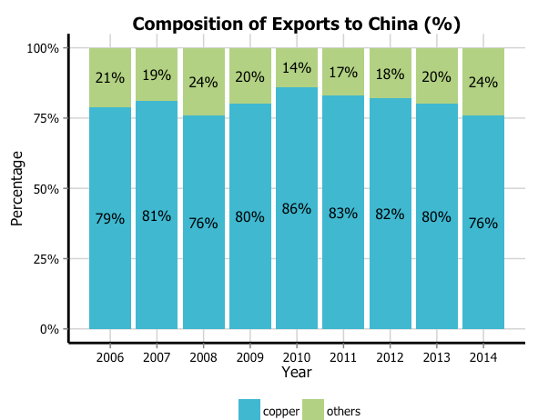

```{r setup, include=F}
knitr::opts_chunk$set(fig.width = 6, message = F, warning = F, 
                      comment = "", cache = F)
```

```{r, echo=FALSE}
source(file = "https://raw.githubusercontent.com/EvaMaeRey/little_flipbooks_library/master/xaringan_reveal_parentheses_balanced.R")
```

---

<blockquote class="twitter-tweet"><p lang="en" dir="ltr">I couldn&#39;t resist getting in on the fun <a href="https://t.co/tt5AUZArD5">pic.twitter.com/tt5AUZArD5</a></p>&mdash; Jacqueline Nolis (@skyetetra) <a href="https://twitter.com/skyetetra/status/1160012260456062977?ref_src=twsrc%5Etfw">August 10, 2019</a></blockquote> <script async src="https://platform.twitter.com/widgets.js" charset="utf-8"></script>

Пробајте:

```{r, eval=F }
n = c(2, 3, 5) 
s = c("aa", "bb", "cc") 
b = c(TRUE, FALSE, TRUE) 
df = data.frame(n, s, b)  
```


---

# Резиме

- Презентацијата е розева дека користам урнек од RLadies;
- .Rmd (R Markdown) е околината во која ќе работиме;
- Нов R Notebook: Мени: File -> New File -> R notebook
- Корисни кратенки:
  - code chunks (ctrl+alt+i)
  - pipes %>% (ctrl+shift+m)
  - assignment ( <- )
  - view()
- за едниот од графиконите ќе ви треба install.packages("geofacet")
---

# Повторување: што е бавен ggplot?


„Бавен ggplot“ значи постепено пишување, наместо спојување на цели елементи заедно, како следи:

- функцијата **aes()** е извадена од функцијата **ggplot()**;
- се користат помалку функции: на пр. **labs()** за наслов наместо **ggtitle()**;
- користење на функција повеќе пати, на пример: **aes(x = var1) + aes(y = var2)** наместо **aes(x = var1, y = var2)**;
- употреба на функции од **base R** и **tidyverse**. Сѐ друго се повикува со :: 
- сите аргументи се пишуваат експлицитно: **aes(x = gdppercap)**, а не **aes(gdppercap)**
- наредбите во **ggplot** се подредени така што реактивноста е очигледна; исто така прилагудувањата на **scale** се блиску до **aes**

---

Споредба на „обичен“ и „бавен“ ggplot

Вообичаено:

```{r, eval = F}
ggplot(my_data, aes(var1, y = var2, col = var3)) +
  geom_point() +
  ggtitle("My Title") +
  labs(x = "the x label", y = "the y label", col = "legend title")
```

Бавно: 

```{r, eval = F}
ggplot(data = my_data) +
  aes(x = var1) +
  labs(x = "the x label") +
  aes(y = var2) +
  labs(y = "the y label") +
  geom_point() +
  aes(col = var3) +
  labs(col = "legend title") +
  labs(title = "My title")
```

---

# Почнувате

Вчитајте го tidyverse.

```{r}
library(tidyverse)
```

И вчитајте ги податоците од github страницата на tidytuesday.

```{r}
school_diversity <- readr::read_csv("https://raw.githubusercontent.com/rfordatascience/tidytuesday/master/data/2019/2019-09-24/school_diversity.csv") 
```

---

# Ѕирнете ги податоците

```{r}
glimpse(school_diversity)
```

---

# Имињата на колоните со мали букви

Ова е трансформација заради олеснување. Сакаме кога ќе правиме други трансформации да не грешиме во **Total** или **d_Locale** како што се оригиналните имиња на колоните.

```{r}
names(school_diversity) <- c("LEAID", "LEA_NAME", "state", "locale", "school_year", "aian", "asian", "black", "hispanic", "white", "multi", "total", "diverse", "variance", "int_group")
```

---

# Две визуелизации, идеи?


Секој круг да биде вредноста од **total**. Но тоа можеби се премногу податоци за на еден графикон (27.944). Можеби подобро групирање по тип (урбано/рурално/итн.) и посебни графикони (facet) да бидат регионите од САД. Но, нив ги нема во податоците.

---

# Идеи, продолжено (за направи сам :-))



По сличен начин на размислување, групирај ги податоците по држава и подели ги (facet) по региони, така што за секоја држава ќе има по еден **bar** што ќе покажува ентичка распределба на учениците.

---

# Региони во САД? 

```{r regions}
NE.abrv <- c("CT","ME","MA","NH","RI","VT","NJ","NY","PA")

MW.abrv <- c("IN","IL","MI","OH","WI","IA","KS","MN","MO","NE",
             "ND","SD")

S.abrv <- c("DE","DC","FL","GA","MD","NC","SC","VA","WV","AL",
            "KY","MS","TN","AR","LA","OK","TX")

W.abrv <- c("AZ","CO","ID","NM","MT","UT","NV","WY","AK","CA",
            "HI","OR","WA")

NE_tbl <- tibble(state=NE.abrv, region="Northeast")
MW_tbl <- tibble(state=MW.abrv, region="Midwest")
S_tbl  <- tibble(state=S.abrv,  region="South")
W_tbl  <- tibble(state=W.abrv,  region="West")

```

Не ги знаев регионите, ги ископирав од [интернет](https://stackoverflow.com/questions/46066974/add-column-to-label-u-s-states-by-their-u-s-census-region).

---

# Потоа спојуваме сѐ во еден tibble

```{r}
region_df <- dplyr::bind_rows(NE_tbl, MW_tbl, S_tbl, W_tbl)

school_diversity_w_regions <- dplyr::left_join(x = school_diversity, y = region_df, by="state")
```

Што е tibble? R специфичен формат на dataframe што се користи во tidyverse. Не мора да се грижите за тоа сега.

---
# Конструктивна дигресија

Можеби забележавте дека **спојувањето** се прави со **left_join**.

**dplyr** (што е библиотека дел од **tidyverse**) (и уште повеќе **dbplyr**) можат да се поврзат со надворешни бази на податоци (mySQL, PostgressSQL, SQLite) и да работат со податочни сетови кои се преголеми да се чуваат во една csv датотека.

Ова можеби е пренапредно за овој момент во учењето R, но убавото е во тоа што синтаксата е иста, ако научите **dplyr**, освен поврзување со датабазата што изгледа поразлично, сите други команди се исти.

[dplyr](https://db.rstudio.com/dplyr/)

---

```{r mutate with case when, eval=F, echo=F}
school_diversity <- school_diversity %>% 
  mutate(region = case_when( 
    is.element(state, NE.abrv) ~ "Northeast",
    is.element(state, MW.abrv) ~ "Midwest",
    is.element(state, S.abrv) ~ "South",
    is.element(state, W.abrv) ~ "West",
    TRUE ~ as.character(state)
  ))
```


```{r mutate with map, eval=F, echo=F}
region.list <- list(
  Northeast=NE.abrv,
  Midwest=MW.abrv,
  South=S.abrv,
  West=W.abrv)

school_diversity <- school_diversity %>%
  mutate(mapregion = map_chr(state, names(region.list)[grep(state, region.list)]))
```

---

# Групирање

```{r group the data}
sd_grouped <- school_diversity_w_regions %>% 
  group_by(region, school_year, locale) %>%
  summarise_at(vars("total"),
    list("total_per_locale"=sum))
```

---

# Bubble (slow gg) plot

```{r bubble plot, fig.height=10, echo = F, eval = T}
ggplot(data = drop_na(sd_grouped)) +
  aes(x = total_per_locale / 10^5) + 
  labs(x = "Број на ученици (во сто илјади) ") +
  aes(y = school_year) +
  labs(y = "Години") +
  aes(size = total_per_locale) +
  labs(size = "total_per_locale") +
  aes(group = locale, color = locale) +
  scale_colour_viridis_d(option = "plasma") +
  geom_point(alpha = 0.25) +
  geom_jitter(size = 2.5, alpha = 0.25, width = 1) +
  facet_grid(rows = vars(region)) +
  ggthemes::theme_fivethirtyeight() +
  theme(legend.position = "bottom", legend.title = element_blank()) +
  theme(panel.spacing.y = unit(0.5, 'cm')) +
  guides(size=FALSE) 
```

---

`r apply_reveal("bubble plot")`

---

# Зошто bubble plot беше лоша идеја

1. Не видов дека **SCHOOL_YEAR** се само две години, мислев дека е секоја учебна од 1994 до 2017.

2. Дискусија?
---

# Направи сам


---

# Разноликост во американските училишта

Уште една обработка на податоците

```{r reorganized}
reorganized <-
  school_diversity %>%
  group_by(state, school_year, diverse) %>%
  tally() %>%
  select(state, school_year, diverse, n) %>%
  mutate(diverse = factor(
    diverse,
    levels = c("Extremely undiverse", "Undiverse", "Diverse")
  )) %>%
  group_by(state, school_year) %>%
  mutate(percent = n / sum(n)) %>%
  filter(school_year == "1994-1995")
```

---
# Графикон по држави

```{r geofacet plot, echo = F, eval = T, fig.width=10}
library(geofacet)
ggplot(data = reorganized) + 
  labs(title="School diversity in the US in 1994-1995") +
  aes(x=diverse) +
  labs(x="") +
  aes(y=percent) +
  labs(y="") +
  aes(fill=diverse) +
  labs(fill="") +
  geom_col() +
  scale_fill_manual(values=c("grey10", "grey40", "forestgreen")) +
  scale_y_continuous(breaks=c(0, .5, 1), labels = scales::percent) +
  coord_flip() +
  facet_geo(~state, grid = "us_state_grid1") +
  theme_minimal()+
  theme(
    strip.text = element_text(
      margin = margin(3, 3, 3, 3)
    )) +
  theme(legend.position = "bottom") +
  theme(axis.text.x = element_text(angle=30, hjust=1, vjust=1)) +
  theme(axis.line.x = element_blank()) +
  theme(panel.grid.major = element_line(color = "gray80")) +
  theme(panel.background = element_rect(fill = "gray90")) 
```

---
`r apply_reveal("geofacet plot")`
---

```{css, eval = TRUE, echo = F}
.remark-code{line-height: 1.5; font-size: 80%}
```


